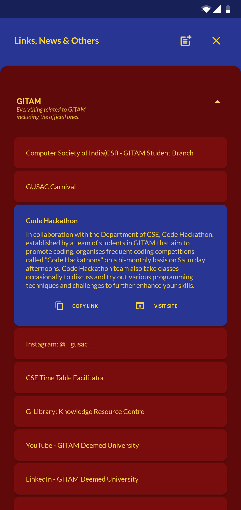

# The GITAM Student App 
**Platform:** Android (.apk)

**Download the latest version:** [GITAM Student App v1.1.1](gsa.apk)

**How to install:** Check the [Installation Guide](misc/installation-guide.pdf)
  

## NOTICE
Thanks to over 600 users who have been using the app so far. Great thanks to those who provided feedback which was valuable in releasing updates. Many other features were meant to be released in future updates. However, due to GITAM's recent migration to the new LMS platform - Moodle, the GITAM Student app is becoming less relevant every day. So, the development process on the app is paused for now. Please do not expect any updates in future until mentioned.
As the app is still functional to some extent, users can still use the app. However, if the app becomes less functional, outdated, or meant to be taken down due to any legal issues, the app will be terminated permanently. Please read the terms & conditions for more details.

Once again, I am so thankful to all users for their interest in the app.

  

## What's new?
* #### v1.1.1
    * Minor bug fixes
* #### v1.1.0
    * Download files from G-Learn directly from the app.
    * Added a section for important Links, News & Others
    * Manage Upto 10 accounts on a device
    * Save results of upto 15 students in G-Results
    * Improved UI
    * Added a notification center
    * Minor bug fixes

        *Screenshot:*

        
  

## About the App
---
We all have an app for everything and it is time GITAM Students had one. This app is made to ease the way for students to access their GITAM Student Portal and Results. This app is unavailable on Google Play Store. This is an unofficial app. Any update or design change in GITAM website leaves the app non-functional and obsolete so there is no guarantee that this app will work in future.
Feedback decides if the app gets any updates. So if you are one of those who like this app, make sure you fill out the Feedback Form at the bottom of this section. Also please share this app to your fellow GITAM students. This app is not made for commercial purpose and will remain ad-free and free to use for its lifetime.

***"There has to be an app for everything."***
 
 

 
 

## Privacy Policy:
This app is built and provided by Samuel Vasamsetti (the developer) at no cost and is intended for use as is.

Information Collection and Use:
For a better experience and usage statistics, the app stores and collects certain personally identifiable information such as your name, user ID (Registered ID) and password. Sensitive information like passwords, etc is safely stored on your device and is not accessible to the developer in any way.

Links to Other Sites: 
This app may contain links to other sites. If you click on a third-party link, you will be directed to that site (possibly on an external browser). Note that these external sites are not operated by me. Therefore, I strongly advise you to review the Privacy Policy of these websites. I have no control over and assume no responsibility for the content, privacy policies, or practices of any third-party sites or services.

Changes to This Privacy Policy: 
The developer may update the Privacy Policy from time to time. Thus, you are advised to review this page periodically (for every update) for any changes. The developer will notify you of any changes by posting the new Privacy Policy on this page.

This policy is effective as of 23.1.2021

## Terms & Conditions:
By downloading or using the app, these terms will automatically apply to you, so you should make sure therefore that you read them carefully before using the app. You’re not allowed to copy, or modify the app, any part of the app in any way. You also shouldn't try to translate the app into other languages, or make derivative versions or upload the app to any market. The app itself, still belongs to the developer. However the developer has no rights to GITAM website. The GITAM logo, website, etc. belong to the authorities of GITAM (Deemed to be University). The illustrations used in the app are provided by icons8.
The GITAM Student app stores and processes personal data that you have provided. It's your responsibility to keep your phone and access to the app secure. The developer therefore recommends that you do not root your phone, which is the process of removing software restrictions and limitations imposed by the official operating system of your device. It could make your phone vulnerable to malware/viruses/malicious programs, compromise your phone’s security features and it could mean that the GITAM Student Login app won't work properly or at all.

You should be aware that there are certain things that the developer will not take responsibility for. Certain functions of the app will require the app to have an active internet connection. The connection can be Wi-Fi, or provided by your mobile network provider, but the developer cannot take responsibility for the app not working at full functionality if you don’t have access to Wi-Fi, and you don’t have any of your data allowance left.

Along the same lines, the developer cannot always take responsibility for the way you use the app.

With respect to developer’s responsibility for your use of the app, when you’re using the app, it’s important to bear in mind that although we endeavor to ensure that it is updated and correct at all times, we do rely on third parties to provide information to us so that we can make it available to you. The developer accepts no liability for any loss, direct or indirect, you experience as a result of relying wholly on this functionality of the app.
It is not recommended to use the app to access "Accounts and Payments" section in student portal for security reasons so use the original website to access sections like this. The app won't allow you to access it.
Remember that the developer of this app is not responsible for any trouble the user gets for making any transactions through this app.
At some point, the app may get an update. The app is currently available on Android – the requirements for system (and for any additional systems we decide to extend the availability of the app to) may change. The developer may also wish to stop providing the app, and may terminate use of it at any time without giving notice of termination to you. Unless the developer tells you otherwise, upon any termination, (a) the rights and licenses granted to you in these terms will end; (b) you must stop using the app, and (if needed) delete it from your device. This might happen if, for example, the app violates any of legal obligations provided by GITAM.

Changes to This Terms and Conditions:
The developer may update the Terms and Conditions from time to time. Thus, you are advised to review this page periodically for any changes. The developer will notify you of any changes by posting the new Terms and Conditions on this page.

These terms and conditions are effective as of 23.1.2021

## Fair Use Disclaimer:
The app is made for a non-profit educational purpose and makes a fair use of copyrighted material. The developer has no rights to such material and made the app with no commercial intentions. The GITAM Logo and the other copyrighted material(including the website) belong to the authorities of GITAM university. The app will be removed on request or conflicts raised from the respective copyright owners.